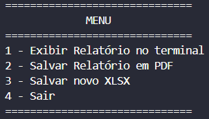
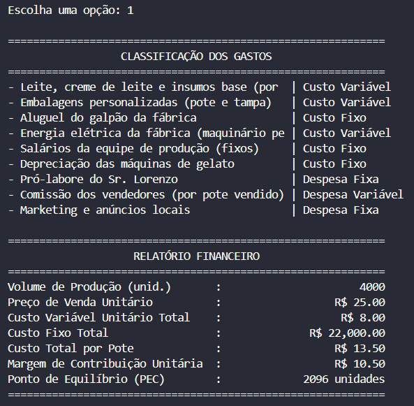
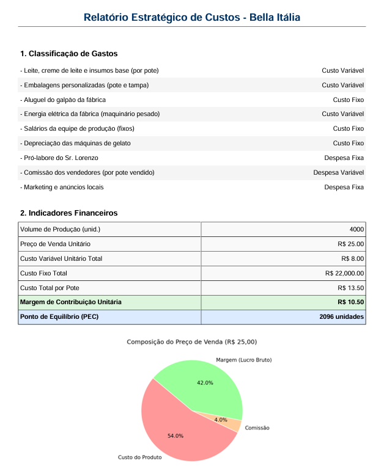
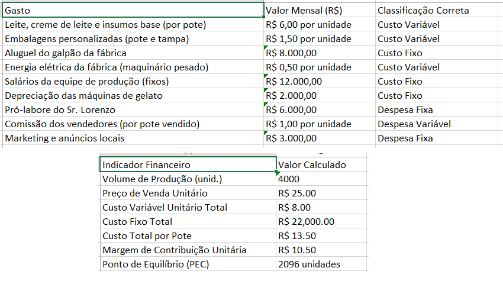

# Sistema de Consultoria e Análise de Custos - Bella Itália

Este projeto automatiza a classificação de gastos, cálculo de indicadores financeiros (Margem de Contribuição e Ponto de Equilíbrio) e a geração de relatórios gerenciais para a sorveteria Bella Itália.

## Tecnologias Utilizadas
* **Python**: Linguagem base do sistema.
* **Pandas**: Processamento e estruturação dos dados financeiros.
* **FPDF**: Criação de relatórios em formato PDF.
* **Matplotlib**: Geração de gráficos analíticos para visualização.
* **Openpyxl**: Formatação e ajuste automático de colunas em arquivos Excel.
* **Re (Regex)**: Limpeza e extração de dados monetários de textos.

## Detalhamento das Funções
O código foi estruturado de forma modular para facilitar a manutenção:

* `limpar_valor_monetario(valor_str)`: Extrai números de strings formatadas (ex: remove o "R$" e converte para float).
* `classificar_gastos(nome_gasto)`: Identifica se um gasto é Custo Variável, Fixo ou Despesa, baseado em palavras-chave.
* `processar_dados(caminho_arquivo)`: O "motor" do sistema. Lê o Excel, realiza os cálculos de custo por pote, margem e PEC.
* `exibir_relatorio_terminal(df, metricas)`: Apresenta os resultados de forma organizada diretamente no console.
* `gerar_grafico_pizza(df, nome_arquivo)`: Cria o gráfico de composição do preço e o salva temporariamente para o PDF.
* `gerar_pdf(df, metricas, nome_arquivo)`: Monta o relatório em PDF com tabelas estilizadas, cores de destaque e o gráfico.
* `salvar_excel(df, metricas, nome_arquivo)`: Exporta os dados com colunas ajustadas automaticamente (auto-fit).
* `menu()`: Gerencia a interface de interação com o usuário.

## Formato de Entrada
O sistema espera um arquivo `.xlsx` contendo as colunas `Gasto` e `Valor Mensal (R$)`. O sistema detecta automaticamente os tipos de despesas.

## Visualizações
1. **Relatório em PDF**: Inclui indicadores coloridos e gráfico de composição.
   [Gráfico de Composição](Resultados.pdf)
2. **Relatório em Excel**: Dados organizados com colunas otimizadas.
   [Planilha Formatada](Resultados.xlsx)

## Pré-requisitos
* Python 3.8+ instalado.
* O arquivo `Dados Custos - Sorveteria.xlsx` no diretório raiz.

### Instalação de bibliotecas
No terminal, instale as bibliotecas necessárias:
* pip install pandas fpdf matplotlib openpyxl

## Menu pricipal

Ao executar a aplicação, o usuário interage através de um menu intuitivo:

* **Opção 1 - Exibir Relatório no Terminal**: Realiza a leitura e o processamento dos dados em tempo real, apresentando no console a classificação de cada gasto e os indicadores financeiros calculados (Margem de Contribuição e Ponto de Equilíbrio). É a forma mais rápida de visualizar os resultados sem gerar arquivos externos.

* **Opção 2 - Salvar Relatório em PDF**: Gera um arquivo chamado `Resultados.pdf`. Este documento é estruturado para fins de apresentação profissional, contendo:
    * Uma tabela organizada com a classificação de todos os gastos.
    * Uma seção de indicadores financeiros com destaques visuais (cores) para facilitar a leitura.
    * Um gráfico de pizza que ilustra a composição do custo por unidade, permitindo compreender rapidamente o peso da comissão, dos custos totais e da margem de lucro.

* **Opção 3 - Salvar novo XLSX**: Cria um arquivo `Resultados.xlsx` com duas abas distintas:
    * **Aba "Classificação"**: Contém a lista detalhada de todos os gastos e suas respectivas classificações contábeis.
    * **Aba "Indicadores"**: Apresenta apenas os resultados financeiros calculados.

* **Opção 4 - Sair**: Encerra a execução do programa de forma segura, liberando os recursos da memória.
